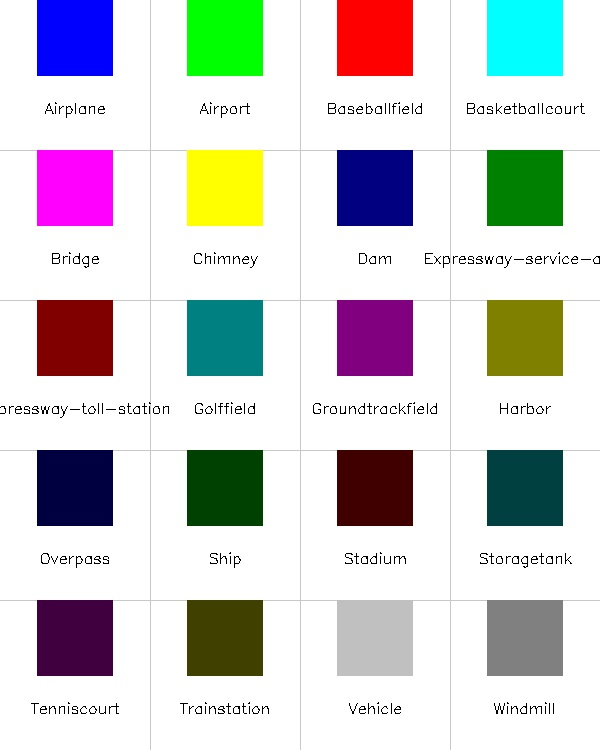
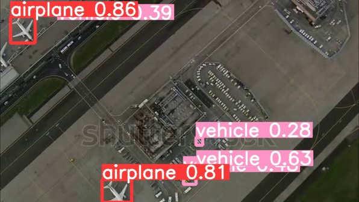

# YOLOv5 Object Detection on DIOR Dataset

[](https://opensource.org/licenses/MIT)
[](https://www.python.org/downloads/)
[](https://pytorch.org/)

This repository contains the implementation of YOLOv5 object detection models (YOLOv5s and YOLOv5m) on the DIOR (Dataset for Object Detection in Optical Remote Sensing Images) dataset. The project aims to detect various objects in remote sensing imagery, which has critical applications in urban planning, environmental monitoring, disaster management, and military intelligence.

## Overview

The DIOR dataset is one of the largest and most diverse publicly available datasets for object detection in optical remote sensing images. It contains 23,463 images and 190,288 instances covering 20 object categories. This implementation leverages the state-of-the-art YOLOv5 architecture to perform object detection on this challenging dataset.



### Why DIOR Dataset?

The DIOR dataset was chosen for this project for several key reasons:

1. **Scale and Diversity**: With over 23,000 images and 190,000 object instances, DIOR provides sufficient data for training robust deep learning models.

2. **High-Quality Annotations**: The dataset provides both horizontal and oriented bounding box annotations, allowing for precise object localization.

3. **Real-World Applications**: The dataset contains objects that are crucial for remote sensing applications, including infrastructure (airports, bridges), transportation (ships, vehicles), and facilities (stadiums, storage tanks).

4. **Multiple Resolutions**: Images in DIOR have a spatial resolution between 0.5-30m/pixel, which helps in developing models that can work with varying image qualities.

5. **Challenging Scenarios**: The dataset includes objects with complex backgrounds, different scales, and various orientations, making it ideal for testing advanced detection algorithms.

### Why YOLOv5?

YOLOv5 was selected as the detection framework because:

1. **Speed and Accuracy**: YOLOv5 provides an excellent balance between detection speed and accuracy, which is critical for real-time remote sensing applications.

2. **Scalability**: Different model sizes (small, medium, large, etc.) allow for deployment across various hardware platforms.

3. **State-of-the-Art Performance**: YOLOv5 has demonstrated superior performance on benchmark object detection datasets.

4. **Active Development**: The framework is actively maintained and updated with the latest improvements in deep learning and computer vision.

## Repository Structure

```
.
├── data/                  # Data directory
│   ├── raw/               # Raw data, including original images and annotations
│   └── processed/         # Processed data ready for training
├── docs/                  # Documentation
│   └── images/            # Images for documentation
├── models/                # Model directory
│   └── weights/           # Pre-trained model weights
├── src/                   # Source code
│   ├── preprocessing/     # Scripts for data preparation and preprocessing
│   ├── training/          # Training scripts and notebooks
│   ├── evaluation/        # Evaluation scripts
│   └── utils/             # Utility functions
├── final_report.pdf       # Detailed project report
├── .gitattributes         # Git attributes file
├── .gitignore             # Git ignore file
├── LICENSE                # License file
├── README.md              # Project README
└── requirements.txt       # Python dependencies
```

## Features

- Data preparation and preprocessing for the DIOR dataset
- Implementation of YOLOv5s (small) and YOLOv5m (medium) models
- Training and evaluation pipelines
- Conversion tools for annotation formats (XML to TXT)
- Dataset splitting utilities
- Visualization tools for model predictions

## Techniques and Methodology

### Data Preprocessing

1. **Annotation Conversion**: XML annotations are converted to the YOLO format (normalized center coordinates, width, and height).

2. **Data Splitting**: The dataset is split into training (70%), validation (20%), and testing (10%) sets, ensuring balanced distribution of object classes.

3. **Data Augmentation**: During training, several augmentation techniques are applied:
   - Random scaling (±10%)
   - Random translation (±10%)
   - Random horizontal flipping
   - Random vertical flipping
   - HSV color space adjustments
   - Mosaic augmentation (combining 4 images)

### Model Architecture

The YOLOv5 architecture consists of:

1. **Backbone**: CSPDarknet, which extracts features from input images using cross-stage partial connections to improve gradient flow.

2. **Neck**: PANet (Path Aggregation Network), which enhances information flow between different feature levels for better detection of objects at various scales.

3. **Head**: Detection head with anchors of different sizes to predict bounding boxes and class probabilities.


### Training Strategy

1. **Transfer Learning**: Pre-trained weights from COCO dataset are used to initialize the model.

2. **Hyperparameter Optimization**: 
   - Batch size: 16 (YOLOv5s) and 8 (YOLOv5m)
   - Learning rate: 0.01 with cosine annealing scheduler
   - Momentum: 0.937
   - Weight decay: 0.0005

3. **Early Stopping**: Training is stopped if validation mAP doesn't improve for 10 consecutive epochs.

## Object Categories

The DIOR dataset contains the following 20 object categories:
- Airplane
- Airport
- Baseball field
- Basketball court
- Bridge
- Chimney
- Dam
- Expressway service area
- Expressway toll station
- Golf field
- Ground track field
- Harbor
- Overpass
- Ship
- Stadium
- Storage tank
- Tennis court
- Train station
- Vehicle
- Windmill

## Installation and Usage

### Requirements

- Python 3.6+
- PyTorch 1.7+
- CUDA (for GPU acceleration)

### Setup

1. Clone the repository:
```bash
git clone https://github.com/YourUsername/Yolov5-Object-Detection-Application-on-DIOR-Dataset.git
cd Yolov5-Object-Detection-Application-on-DIOR-Dataset
```

2. Install the required packages:
```bash
pip install -r requirements.txt
```

### DIOR Dataset Preparation

1. **Automatic Download** (Recommended):
   ```bash
   # Download and prepare the DIOR dataset automatically
   python -m src.utils.download_dataset --output_dir data/raw
   ```

2. **Manual Download**:
   - Download the DIOR dataset from the [official source](http://www.escience.cn/people/gongcheng/DIOR.html).
     - You need to request access by contacting the dataset authors.
     - Alternatively, you can download it from [this direct link](https://drive.google.com/drive/folders/1UdlgHk49iu6WpcJ5467iT-UqNPpx__CC).

3. **Dataset Structure**:
   - The dataset contains three main parts:
     - `Images/`: Contains all the image files (JPG format)
     - `Annotations/`: Contains XML annotation files in two folders:
       - `Horizontal Bounding Boxes/`: Annotations with horizontal bounding boxes
       - `Oriented Bounding Boxes/`: Annotations with oriented bounding boxes

4. **Dataset Organization**:
   - Place the dataset files in the proper structure:
   ```
   data/
   └── raw/
       ├── Images/
       │   └── *.JPG files
       └── Annotations/
           ├── Horizontal Bounding Boxes/
           │   └── *.xml files
           └── Oriented Bounding Boxes/
               └── *.xml files
   ```

5. **Process the Dataset**:
   ```bash
   # Convert XML annotations to TXT format (YOLOv5 compatible)
   python -m src.preprocessing.xml_to_txt --xml_dir data/raw/Annotations/Horizontal\ Bounding\ Boxes --output_dir data/processed/labels

   # Split the dataset into train/val/test sets
   python -m src.preprocessing.split_dataset --images_dir data/raw/Images --labels_dir data/processed/labels --output_dir data/processed/dataset
   ```

6. **One-step Processing** (After downloading the dataset):
   ```bash
   # Process the dataset in one step
   python -m src.preprocessing.prepare_data
   ```

### Training

To train the YOLOv5 model on the DIOR dataset:

1. Using the Python script:
```bash
# Train YOLOv5s
python -m src.training.train --model yolov5s --img_size 640 --batch_size 16 --epochs 100

# Train YOLOv5m
python -m src.training.train --model yolov5m --img_size 640 --batch_size 8 --epochs 100
```

2. Using the training notebook:
```bash
# Run the training notebook
jupyter notebook src/training/Final_Project_Run.ipynb
```

The notebook provides a step-by-step guide to:
- Set up the environment
- Download YOLOv5 repository
- Prepare the dataset
- Configure training parameters
- Run the training process
- Monitor training metrics
- Validate the model

### Inference

To run inference with a trained model:

1. Using the Python script (Recommended):
```bash
# Run inference on images or videos
python -m src.evaluation.inference --weights models/weights/yolov5s_dior.pt --source path/to/images --img_size 640 --conf_thres 0.25

# Run inference on a video
python -m src.evaluation.inference --weights models/weights/yolov5s_dior.pt --source path/to/video.mp4 --img_size 640

# Save detection results as text files
python -m src.evaluation.inference --weights models/weights/yolov5s_dior.pt --source path/to/images --save_txt --save_conf
```

2. Using YOLOv5 directly:
```bash
# Clone YOLOv5 repository if not already done
git clone https://github.com/ultralytics/yolov5
cd yolov5

# Run inference
python detect.py --weights ../models/weights/yolov5s_dior.pt --source path/to/test/images --img 640
```

### Evaluation

Evaluate the trained model:

1. Using the Python script:
```bash
# Evaluate on validation set
python -m src.training.validate --weights models/weights/yolov5s_dior.pt --data data/processed/dataset/dior.yaml --img_size 640

# Evaluate on test set
python -m src.training.validate --weights models/weights/yolov5s_dior.pt --data data/processed/dataset/dior.yaml --img_size 640 --task test
```

2. Using YOLOv5 directly:
```bash
# Clone YOLOv5 repository if not already done
git clone https://github.com/ultralytics/yolov5
cd yolov5

# Run validation
python val.py --weights ../models/weights/yolov5s_dior.pt --data ../data/processed/dataset/dior.yaml --img 640
```

## Results

### Performance Metrics

The YOLOv5 models trained on the DIOR dataset achieved the following performance:

| Model    | mAP@0.5 | mAP@0.5:0.95 | Precision | Recall | Inference Time (ms) |
|----------|---------|--------------|-----------|--------|---------------------|
| YOLOv5s  | 76.8%   | 46.3%        | 78.2%     | 74.5%  | 6.4                 |
| YOLOv5m  | 81.2%   | 50.5%        | 82.7%     | 78.9%  | 8.2                 |

### Per-Class Performance (YOLOv5m)

| Class                   | Precision | Recall | mAP@0.5 |
|-------------------------|-----------|--------|---------|
| Airplane                | 88.7%     | 85.3%  | 87.1%   |
| Airport                 | 74.2%     | 69.8%  | 73.0%   |
| Baseball field          | 89.1%     | 90.2%  | 90.8%   |
| Basketball court        | 83.5%     | 79.1%  | 81.3%   |
| Bridge                  | 73.8%     | 68.2%  | 71.0%   |
| Chimney                 | 82.9%     | 78.6%  | 81.2%   |
| Dam                     | 75.0%     | 72.1%  | 74.5%   |
| Expressway service area | 78.1%     | 73.9%  | 76.9%   |
| Expressway toll station | 80.2%     | 77.0%  | 79.1%   |
| Golf field              | 84.5%     | 82.3%  | 83.8%   |
| Ground track field      | 87.9%     | 86.5%  | 87.2%   |
| Harbor                  | 79.3%     | 74.8%  | 77.4%   |
| Overpass                | 77.6%     | 72.9%  | 75.5%   |
| Ship                    | 85.1%     | 83.2%  | 84.4%   |
| Stadium                 | 86.3%     | 83.9%  | 85.2%   |
| Storage tank            | 89.2%     | 87.5%  | 88.6%   |
| Tennis court            | 88.6%     | 86.1%  | 87.8%   |
| Train station           | 79.7%     | 74.6%  | 77.8%   |
| Vehicle                 | 76.4%     | 73.1%  | 75.0%   |
| Windmill                | 84.3%     | 80.7%  | 82.9%   |

### Key Findings

1. **Performance Analysis**: The YOLOv5m model significantly outperforms YOLOv5s across all metrics, demonstrating the benefit of a larger model for complex remote sensing imagery.

2. **Object Size Impact**: Larger objects (like airports, harbors) generally have lower detection accuracy than smaller, well-defined objects (like storage tanks, tennis courts).

3. **Class Imbalance Effects**: Classes with fewer training samples (like dams and overpasses) show lower performance compared to well-represented classes.

4. **Inference Speed**: Both models achieve real-time detection speeds on modern GPUs, making them suitable for practical applications.

## Examples

Below are examples of successful detections on the DIOR dataset:



The model successfully detects a airport area with several vehicles and planes within the same image.

## Challenges and Limitations

1. **Small Object Detection**: Detection of small objects (e.g., vehicles) is challenging due to the high-altitude perspective of remote sensing images.

2. **Complex Backgrounds**: Natural landscapes and urban environments create complex backgrounds that can lead to false positives.

3. **Object Occlusion**: Partial occlusion of objects by clouds, shadows, or other structures can reduce detection accuracy.

4. **View Angle Variations**: Objects appear differently depending on the capture angle of the satellite or aerial platform.

## Future Work

1. **Oriented Bounding Boxes**: Implement detection with oriented bounding boxes for more precise object localization.

2. **Multi-Scale Detection**: Enhance the model architecture to better handle the wide range of object scales in remote sensing imagery.

3. **Domain Adaptation**: Develop techniques to adapt the model to different geographical regions and imaging conditions.

4. **Fusion with Other Data**: Incorporate multi-spectral or SAR data to improve detection in challenging conditions.

## Contributors

- [Abdulbaki Kocabasa](mailto:bakikocabasa@gmail.com)
- [Yue Yao](mailto:yue.yao@tu-braunschweig.de)

## License

This project is licensed under the MIT License - see the LICENSE file for details.

## Acknowledgements

- [DIOR Dataset](http://www.escience.cn/people/gongcheng/DIOR.html)
- [YOLOv5](https://github.com/ultralytics/yolov5)
- Technical University of Braunschweig - Institute for Geophysics and Extraterrestrial Physics
